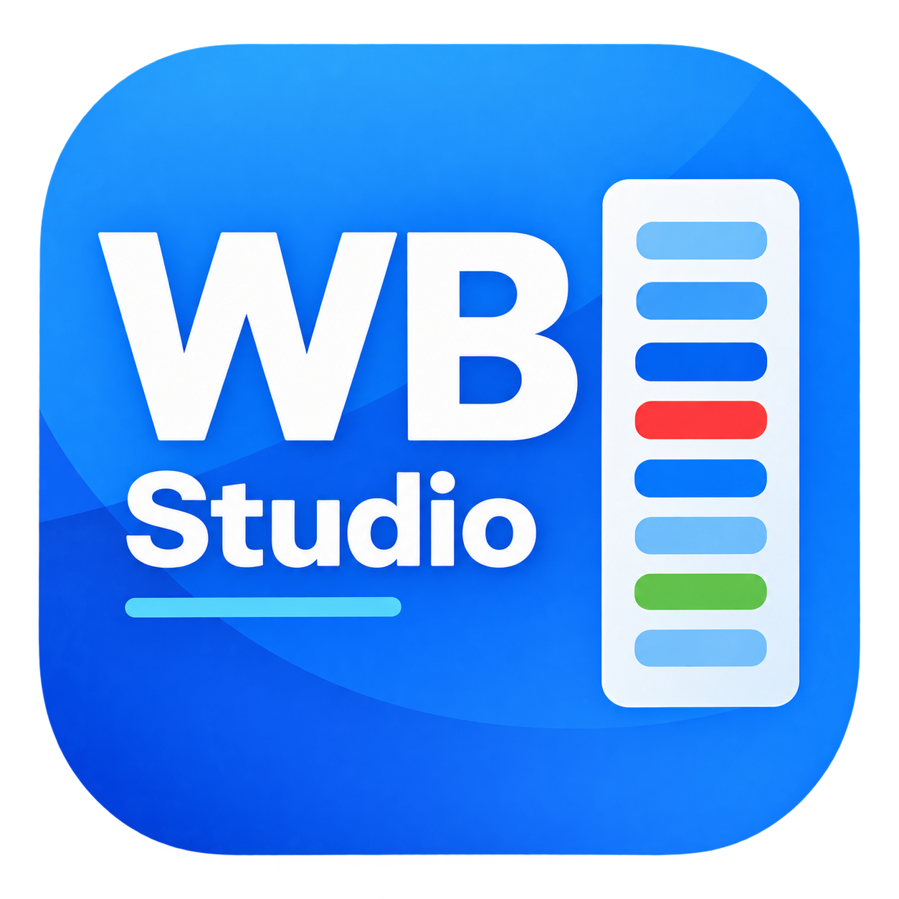
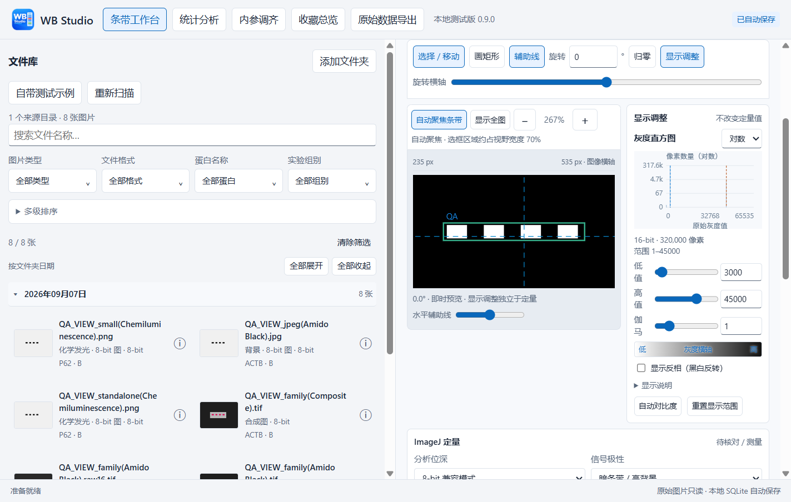
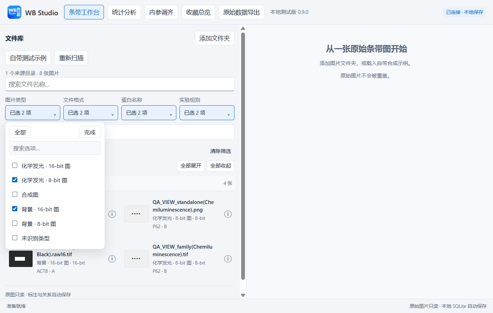

 WB Studio

**用于 Western Blot 图片管理、条带定量、统计分析和实验资料导出的 Windows 桌面软件。**

当前版本：**v0.8.2 · 测试版**  
支持平台：Windows 10 / 11，64 位；当前界面语言为简体中文。

作者与维护者：**Mike Wu**。

# 写在最前
作为一位医学在读博士，跑蛋白和蛋白数据的处理真的耗费了我太多的心力，好在现在有了ChatGPT的支持，尤其是GPT6的出现，帮助我完成了这次的vibe coding，完成了这样一个粗糙的小软件，来实现我对所有蛋白条带的管理和分析，这个软件可以轻松一览你所有的条带并分析灰度值，并且为你的每一条目的条带匹配上对应的内参或者另一条你要的作为分母的条带，快速帮你判断趋势；此外还支持一键导出原始数据的功能，相信大家在发稿前，整理原始数据文件也要花费大量的精力吧，本软件支持一键导出排好版的原始数据文件，轻松解放大家的双手。

因为是vibe coding的作品，必然还有很多bug和可以优化的地方，我自己也会慢慢用这个软件，有时间的话会逐渐迭代，大家有任何的问题都欢迎在issue里面提出。

格外需要注意，本软件免费公开在这里，不是拿给大家去卖的，希望大家尊重我的劳动成果，也尊重我一天重置两次pro 5x额度的高昂代价，但是欢迎将这个软件分享给你身边的人，希望能为大家的科研生活带来一些便利。

P.S. 作为自己发布的第一个作品，还是有点小紧张的，望大家轻喷。如果大家喜欢的话，可以请我喝杯咖啡吗hhh（赞赏二维码在最后↓）。

**发布方式：仅提供 Windows 程序，暂不公开项目源码、测试与构建工程。** 本版本免费提供，采用 [PolyForm Strict 1.0.0 非商业许可](LICENSE)。下载后请先阅读 [许可说明](docs/许可说明.md)。

WB Studio 将原始图片、实验与蛋白标签、泳道分组、内参关系和统计组合放在同一个工作流程中。适合希望减少图片查找、手工整理灰度比值和原始资料排版工作的实验人员。

图片在本机处理，原始文件保持不变；选框、标签、测量记录和绑定关系单独保存在本地。软件使用实际 **ImageJ 1.54q** 完成分析副本的像素测量。

[完整使用指南](docs/用户使用指南.md) · [v0.8.2 更新说明](docs/v0.8.2更新说明.md) · [GitHub 发布准备清单](docs/GitHub发布准备.md)

## 功能一览

| 模块 | 主要功能 | 输出 |
|---|---|---|
| **条带工作台** | 批量导入、分类筛选、日期折叠、标签与分组预设、自动聚焦、对比度调节、选框和泳道识别、ImageJ 测量、内参绑定、双条带比值、收藏 | 逐泳道测量值、背景校正信号和比值 |
| **统计分析** | 共用候选图库，读取工作台已计算的比值，按实验组整理三重复，支持同一张膜上的多个生物样本 | 均值 ± SD、单个数据点、统计检验结果、可复制到 Excel 的表格、可复用的图片组合 |
| **内参调齐** | 同时查看多个内参的条带图和泳道柱状图，按对应样本汇总信号 | 再次上样的建议体积、补加 1× SDS 体积 |
| **原始数据导出** | 按实验 → 蛋白 → 图片组合整理，折叠目录、拖动排序，关联化学发光图、背景图和合成图 | 三列排列的白底 PDF；统计页另可导出保留原文件的 ZIP |

## 界面预览

下图来自 v0.8.2 的实际界面，图片和名称均为合成测试素材，不代表真实实验结果。



<details>
<summary>查看图片类型与多选筛选界面</summary>



</details>

## 下载与启动

正式发布后，请在本仓库的 **Releases** 中下载 Windows 便携包，例如 `WB_Studio_v0.8.2_Windows_x64.zip`。GitHub 自动生成的 `Source code (zip)` 仅是介绍与使用文档仓库的快照，不包含 WB Studio 项目源码，也不是 Windows 程序包。请通过本仓库的 Releases 入口获取实际附件；发布页建立前，本文件仅为本地发布候选。

运行环境：

- Windows 10 / 11，64 位。
- .NET Framework 4.7.2 或兼容的更高版本。
- Microsoft Edge WebView2 Runtime。
- 完整便携包附带 Python、ImageJ 和私有 Java 运行时，无须另外安装 Python、Java 或 Fiji。

启动步骤：

1. 将压缩包**完整解压**到可写的本地目录，例如 `D:/WB_Studio`。
2. 打开解压后的程序文件夹，双击 **`WB Studio.exe`**。
3. 保留程序旁的 `app`、`runtime`、DLL 和配置文件，不要只复制 exe。

程序会建立 `data` 文件夹保存图库索引、标注、设置和缓存。请将程序及其数据目录放在本地磁盘运行；OneDrive 等同步目录中的原图可以作为读取来源。

## 第一次使用

可先点击 **“自带测试示例”**。软件附带 3 张 MANF 目的图和 3 张 ACTB 内参图，每张有 4 个泳道，已预设目的图与内参关系。

1. 依次打开 ACTB 内参图，核对条带选框，点击 **“确认并测量”**。
2. 再对 MANF 目的图完成相同操作，查看逐泳道的目的蛋白 / 内参比值。
3. 进入 **“统计分析”**，选择 3 张 MANF 图片及其选框。
4. 核对每组 3 条有效比值，选择数据口径和统计方法。条件满足时自动生成比较，也可点击 **“生成比较”**。
5. 点击 **“复制数据到 Excel”**，在 Excel 中粘贴。
6. 填写名称并点击 **“保存组合”**，到 **“原始数据导出”** 预览并导出 PDF。

合成示例仅供练习。示例未附背景图和合成图，PDF 对应位置会显示缺失说明。

## 使用自己的实验图片

### 1. 导入与整理

点击 **“添加文件夹”**，软件递归扫描子文件夹并显示进度。左侧图库与右侧工作区独立滚动，支持文件名搜索、两级排序、日期折叠和图片信息查看。

**图片类型、文件格式、蛋白名称、实验组别**均支持下拉多选：同一栏任意匹配，不同栏同时满足。统计分析页使用同一图库，并可按收藏状态筛选。

Bio-Rad 图片根据文件名最后括号中的拍摄模式分类：

| 模式与位深 | 可筛选类型 |
|---|---|
| `Chemiluminescence`，8-bit | 化学发光 · 8-bit 图 |
| `Chemiluminescence`，16-bit | 化学发光 · 全部 16-bit 图 |
| 实际为 16-bit，且名称包含 `(Chemiluminescence).raw16`，其后可有 `.tif` 等扩展名 | 化学发光 · 16-bit 分析原图 |
| `Composite` | 合成图 |
| `Amido Black`、`Stain Free`、`Colorimetric` 等其他模式 | 背景图，并区分 8-bit / 16-bit |
| 无可识别的末尾模式括号 | 未识别类型 |

支持 TIFF、PNG、JPEG、BMP，以及内容为可识别 TIFF 等受支持图像的 `.raw16` 文件；并非任意无头 RAW 数据均能读取。测量要求为**单页、单通道、8-bit 或无符号 16-bit 灰度图**。RGB、调色板或多页图像不直接用于定量。

日期分组统一读取**图片直接所在文件夹名称中的完整年月日**。建议目录：

```text
WB_images/
└─ 2026-09-06/
   ├─ Exp01_MANF_R1(Chemiluminescence).raw16.tif
   ├─ Exp01_MANF_R1(Amido Black).tif
   └─ Exp01_MANF_R1(Composite).tif
```

日期不从 TIFF 内部时间、图片文件名或修改时间推断。关联图片应位于同一文件夹，基础文件名相同，仅末尾拍摄模式不同。

### 2. 设置实验、蛋白与泳道分组

右侧“实验”和“蛋白”为可输入的**单选标签**：输入新名字后按 Enter 创建，已有名字可下拉选择。实验、蛋白和分组预设选项右侧的 **⋯** 支持重命名和删除；左侧多选筛选不会改变这些标签的单选属性。

点击 **“设置预设”**，编辑组名、处理条件及每组样本数。保存并应用后，泳道数同步为**各组样本数之和**，组名按预设顺序展开。

支持两种常见布局：

| 实际实验布局 | 预设与统计选择 |
|---|---|
| 3 张膜，每张膜每组各 1 个生物样本 | 每组样本数设为 1；在统计页选择 3 张目的图 |
| 1 张膜，3 个对照样本 + 3 个实验样本 | 建立 2 个组，每组样本数设为 3；在统计页只选这一张目的图 |

例如 `对照1、对照2、对照3、实验1、实验2、实验3` 会展开为 6 个泳道，并自动按组汇总六个目的 / 内参比值。交错上样时，须按实际顺序修改泳道表。

**生物样本 ID 可留空；配对检验需要完整 Pair ID。** 独立样本数由实验来源决定，同一样本重复上样或重复曝光不构成新的生物学重复。

### 3. 框选、测量与计算比值

先调整观看范围和显示对比度，再画矩形框、识别泳道并人工核对位置。软件支持 0.1° 旋转、辅助线、拖动选框边角，以及 **＋ / −、Ctrl＋滚轮**。

所有可预览图片类型均支持自动聚焦：优先使用已有选框，其次使用同次拍摄分析图的位置，再尝试自身定位；没有可靠位置时显示全图。手动视图会保留，点击 **“自动聚焦条带”** 可恢复自动模式。

完成目的图和内参图的测量后，为每个目的选框选择对应内参选框并核对泳道，软件计算背景校正后的**目的蛋白 / 内参**比值。双条带模式可选择 **A/B** 或 **A/(A+B)**，再点击 **“计算比值”**。

显示用的对比度、伽马和反相不会写入定量像素。更改选框、旋转或分析参数后，需要重新测量。

### 4. 统计与保存组合

统计页自动读取工作台已有的有效比值，按组选择 **3 条有效记录**。可使用原始比值，或相对于所选对照组均值的比值。

| 统计方法 | 当前范围 |
|---|---|
| Welch t + Holm | 独立样本的所选两两比较 |
| 单因素 ANOVA + 预设比较（Holm） | 总体检验及所选组间比较 |
| 配对 t | 两组，完整且一一对应的 Pair ID |
| 精确置换检验 + Holm | 独立样本均值差 |
| Two-way ANOVA | 因素 A、因素 B 及交互作用；要求因素组合完整、每格重复数相同 |

Two-way ANOVA 当前支持平衡的独立样本设计，不支持重复测量、不平衡或混合效应模型，未提供双因素事后比较和简单效应检验。三个效应的 P 值未自动进行多重校正。

选定最终使用的 **1–3 张图片及各自选框** 后，点击 **“保存组合”**，供以后恢复或导出。图片张数与生物样本数分别记录；一张膜可提供多个真实独立样本。修改选择或相关分析信息后，应重新保存组合。

### 5. 内参调齐与资料导出

**内参调齐**支持选取多个已测量的内参选框。默认先将每张图的泳道信号除以纳入泳道的均值，再对同一样本的多个相对值取均值，用于估算再次上样体积和补加 1× SDS 体积。需要核对跨图样本对应关系、原上样体积及检测条件；结果是上样估算。

**原始数据导出**按实验和蛋白组织已保存组合，可拖动顺序，每个实验从新页开始。三列依次显示化学发光图、背景图和合成图；多个关联候选可自行选择。

| 导出选项 | 内容 |
|---|---|
| 页面 | A4 / A3，纵向 / 横向，每页 1 或 2 个蛋白 |
| 图片显示 | 完整图片，或放大条带至矩形框宽约占图片显示框的 50% |
| 联动缩放 | 三类图片按同一条带位置等比缩放，保留显示框内的周围画面 |
| PDF 图像 | 白底排版，全部输出为 8-bit 灰度图 |
| 化学发光图 | 使用工作台已保存的对比度、伽马和反相参数 |
| 原始文件 | 在统计页另导出 ZIP，保留所选原图字节并附来源清单 |

三处缩放比例分别服务于不同页面：**工作台自动聚焦约 70%，统计卡片约 80%，PDF 放大选项约 50%**。放大视图可能不显示图像边缘；需要完整边缘时选择“完整图片”。

PDF 是经过显示处理和排版的资料文件，不替代原始图像。定量分析始终与显示处理分开。

## 数据保存与备份

- 标签、收藏、选框、泳道、内参关系和页面设置自动保存。
- 编辑分组预设后点击 **“保存预设”**；选定用于统计和导出的图片后点击 **“保存组合”**。
- 正常关闭软件后备份整个 `data` 文件夹，同时单独备份外部原图目录。
- 原图移动或改名后，对新位置添加文件夹或重新扫描，软件通过内容校验重新关联；它不会自动搜索所有磁盘。
- 分享软件使用干净便携包，排除个人数据库、原图、缓存和日志。

## 测量方法与当前边界

WB Studio 内置实际 ImageJ 引擎，可选择 8-bit 兼容模式或原始位深分析。ImageJ 执行分析副本的转换、旋转和矩形像素统计；泳道检测、背景区域选择、内参映射和统计检验由 WB Studio 实现。

当前背景规则使用每个泳道矩形**顶部 2 行与底部 2 行**估计背景，中间部分作为信号区。因此，选框高度至少 5 px，背景行应落在合适位置。这不是 ImageJ Gel Analyzer 的轮廓峰面积流程，也未提供 rolling-ball 背景扣除。

本版统计流程以每组 3 条有效记录为主。自动识别、饱和情况、条带位置和生物学重复来源仍需人工核对。使用 ImageJ 不代表整个软件或某项分析结果获得期刊认证。

在实验方法中，请记录 WB Studio 版本、ImageJ 版本、分析位深和映射范围、背景规则、内参归一化方式及统计方法。完整操作细节见[使用指南](docs/用户使用指南.md)。

## 发布范围

公开仓库用于提供软件介绍、使用指南、演示截图、版本说明、问题反馈和下载入口。Windows 便携程序将作为 Releases 附件提供，项目源码、测试和构建依赖包暂不对外提供。

本次发行使用后端字节码、编译后的 Java 桥接及压缩打包的界面运行资源，不附 WB Studio 的原始开发工程、源映射、测试或构建脚本。浏览器运行资源和字节码仍可能被提取或逆向分析，这不是不可逆的代码加密。第三方组件依各自许可保留相应文件。实际验证范围见 [发布验证](docs/发布验证.md)。

## 反馈问题

公开仓库启用 Issues 后，可在其中提供：

- 软件版本、Windows 版本、所在页面。
- 可复现的操作步骤、期望行为与实际行为。
- 报错文字，以及相关图片的格式、位深、通道数和尺寸。
- 去除个人信息的截图，或能复现问题的合成示例。

不要在公开 Issue 中附带未公开实验数据、完整图库数据库、访问令牌或未经检查的日志。

## 许可与致谢

WB Studio v0.8.2 免费提供，采用 [PolyForm Strict License 1.0.0](LICENSE)，允许原文范围内的非商业使用，不授权他人修改或再次分发程序。其列明的教育、公共科研等机构使用条款不受资助来源限制，详见 [中文许可说明](docs/许可说明.md)。项目源码暂不公开；第三方组件仍按各自许可分发。

感谢 ImageJ 及其他第三方组件。组件许可独立保留，详见：

- [桌面与 Python 组件说明](docs/第三方组件说明.md)
- [ImageJ 与 Java 运行时说明](docs/ImageJ与Java说明.md)
- [ImageJ 版本与校验清单](docs/imagej-manifest.json)

首次公开发布所需的仓库信息、许可证、安装包、素材与检查项见 [GitHub 发布准备清单](docs/GitHub发布准备.md)。

## 你可以这样支持我

如果觉得这个软件还不错，可以请我喝杯咖啡哦！


